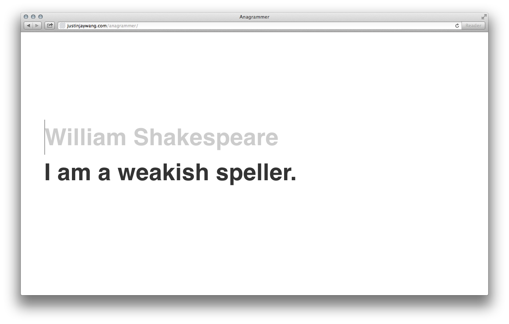

# Anagrammer

**Anagrammer** takes in a word or phrase and returns its [anagram](http://en.wikipedia.org/wiki/Anagram).

Suggestions to try:

- *Soccer player*
- *New York Times*
- *Dormitory*
- *Operating systems*
- *Career politians*
- *The meaning of life*
- Names of people (you, your friends, your enemies)